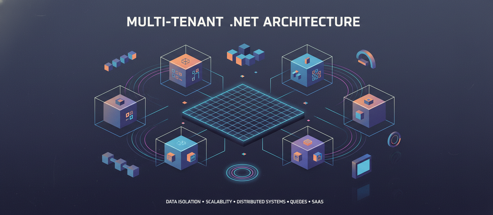

# Multi-tenant além do TenantId: problemas reais e aprendizados em sistemas .NET



Em muitos sistemas SaaS, a estratégia multi-tenant começa de forma extremamente simples: adicionamos uma coluna `TenantId` nas tabelas e seguimos o desenvolvimento normalmente.

O problema é que o desafio nunca foi adicionar a coluna.

O verdadeiro desafio é garantir que ninguém esqueça dela.

No começo do projeto, isso normalmente parece simples. O time é pequeno, existem poucas queries e praticamente todo mundo conhece a arquitetura inteira do sistema. O isolamento entre tenants parece apenas uma regra de banco de dados.

Mas conforme o sistema cresce, novos problemas começam a aparecer:

- background jobs;
- filas;
- cache compartilhado;
- exportações;
- relatórios;
- integrações;
- webhooks;
- queries SQL manuais;
- crescimento do time.

E nesse momento, o multi-tenant deixa de ser apenas uma preocupação de modelagem de dados.

Ele passa a ser uma preocupação arquitetural transversal.

## O problema começa quando o sistema cresce

Em muitos projetos, o isolamento entre tenants depende diretamente da disciplina dos desenvolvedores.

O código normalmente começa assim:

```csharp
var campaigns = await _dbContext.Campaigns
    .Where(x => x.TenantId == tenantId)
    .ToListAsync();
```

E honestamente: no início isso funciona.

O problema é que, conforme o sistema cresce, essa abordagem começa a depender demais de memória humana.

Alguém inevitavelmente vai esquecer o filtro.

Principalmente em cenários como:

- manutenção rápida em produção;
- hotfix;
- relatórios complexos;
- queries SQL;
- jobs assíncronos;
- novos desenvolvedores entrando no projeto.

O maior erro em sistemas multi-tenant é transformar isolamento de dados em responsabilidade humana.

Em sistemas grandes, o problema não é "se" alguém vai esquecer o filtro.

O problema é "quando".

## Nossa abordagem no .NET com EF Core

Depois de alguns problemas e aprendizados, começamos a tratar o multi-tenant como uma responsabilidade da arquitetura — e não apenas da query.

A ideia principal era simples:

> O sistema precisava saber automaticamente qual é o tenant atual sem depender do endpoint ou da query.

## Centralizando o contexto do tenant

O primeiro passo foi centralizar as informações do usuário autenticado.

Em vez de resolver `TenantId` manualmente em vários pontos da aplicação, criamos um contexto autenticado responsável por expor essas informações para toda a aplicação.

Algo parecido com:

```csharp
public sealed class AuthenticatedUser
{
    public Guid TenantId { get; init; }
}
```

Isso parece simples, mas muda bastante a arquitetura.

A partir desse momento, o sistema inteiro passa a conhecer o tenant atual de forma consistente.

## Global Query Filters

Depois disso, começamos a usar Global Query Filters do Entity Framework Core.

A ideia era simples: impedir que o isolamento dependesse da memória do desenvolvedor.

```csharp
builder.Entity<Message>()
    .HasQueryFilter(x =>
        x.TenantId == _authenticatedUser.TenantId &&
        !x.IsDeleted);
```

Isso resolveu boa parte dos problemas.

Além de reduzir drasticamente erros humanos, também ajudou a padronizar o comportamento da aplicação inteira.

Mas isso definitivamente não resolveu tudo.

E essa foi uma das partes mais importantes que aprendemos.

## Onde as coisas ficaram mais perigosas

Os problemas mais complicados começaram a aparecer quando saímos do fluxo tradicional HTTP.

Principalmente em:

- background jobs;
- mensageria;
- processamento assíncrono;
- webhooks;
- integrações.

Nesse tipo de fluxo, não existe mais usuário logado.

O request HTTP já morreu.

O contexto autenticado desapareceu.

E nesse momento, o isolamento entre tenants começa a ficar perigoso novamente.

## Background jobs e mensageria

Em processamento assíncrono, não existe usuário logado para “salvar” o isolamento do sistema.

Foi aí que começamos a propagar explicitamente o `TenantId` nos eventos.

```csharp
public record CampaignCreatedEvent
{
    public Guid TenantId { get; init; }
}
```

Isso permitiu reconstruir corretamente o contexto durante o processamento do job.

Sem isso, alguns cenários começavam a ficar perigosos:

- processamento cruzado;
- consultas incorretas;
- dados inconsistentes;
- dificuldade de rastreabilidade.

Esse tipo de problema normalmente não aparece em projetos pequenos.

Mas aparece rapidamente quando o sistema começa a crescer.

## Cache compartilhado

Outro ponto importante foi o cache.

Em sistemas multi-tenant, Redis compartilhado sem isolamento adequado pode virar um problema rapidamente.

Por exemplo:

```txt
campaigns:active
```

Essa chave parece inofensiva.

Mas em um ambiente multi-tenant ela pode causar vazamento indireto de informações.

Depois disso, começamos a adotar prefixos por tenant:

```txt
tenant:{tenantId}:campaigns:active
```

Parece detalhe.

Mas são exatamente esses detalhes que começam a fazer diferença conforme a arquitetura evolui.

## O que aprendemos na prática

Uma das principais lições foi entender que multi-tenant não é apenas uma preocupação de banco de dados.

Ele impacta:

- segurança;
- filas;
- cache;
- observabilidade;
- permissões;
- processamento assíncrono;
- debugging;
- manutenção.

Também percebemos que boa parte dos problemas não apareciam durante o desenvolvimento inicial.

Eles apareciam meses depois.

Principalmente quando:

- o sistema crescia;
- o número de fluxos aumentava;
- novos desenvolvedores entravam no projeto;
- integrações começavam a surgir.

E honestamente: muitos desses problemas são difíceis de perceber até acontecerem em produção.

## Trade-offs

Global Query Filters ajudaram muito no isolamento automático.

Mas também adicionaram alguns trade-offs importantes.

Por exemplo:

- debugging mais complexo;
- comportamento implícito nas queries;
- necessidade de bypass controlado;
- maior atenção em performance;
- maior cuidado com jobs administrativos.

Em alguns momentos, também precisamos criar mecanismos explícitos para desabilitar filtros em cenários administrativos e fluxos internos.

E isso exige bastante cuidado.

Porque toda exceção de isolamento começa a virar um ponto potencial de risco.

## Conclusão

Durante muito tempo, enxergamos multi-tenant apenas como uma estratégia de modelagem de banco de dados.

Hoje, vejo muito mais como uma preocupação arquitetural transversal.

O verdadeiro desafio nunca foi adicionar `TenantId`.

O desafio é garantir isolamento consistente quando o sistema começa a crescer.

Principalmente quando entram em cena:

- filas;
- jobs;
- cache;
- integrações;
- múltiplos times;
- manutenção contínua.

No final, o maior aprendizado foi perceber que isolamento entre tenants não pode depender apenas da memória do desenvolvedor.

A arquitetura precisa ajudar nisso.

